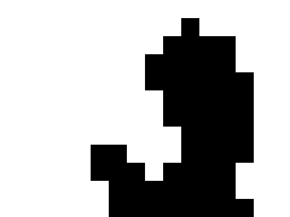

# Bad Apple on NES (NROM - 32KB)

<p align="center">
  
</p>

<p align="center">
  <a href="https://www.youtube.com/watch?v=by-lQ6QA38I">
    Watch the demo on YouTube
  </a>
</p>

---

This is a Nintendo Entertainment System ROM that plays the MV of  
[Bad Apple!!](https://www.youtube.com/watch?v=9lNZ_Rnr7Jc) under strict hardware constraints: **NROM 32KB, no mapper, no audio**.

It renders the video at:

**16x12 resolution @ 5 FPS** (_Improved, before: 10x9 @ 1fps_)


## Why is the quality so low?

The NES in NROM configuration is heavily limited:

- Maximum ROM size: 32KB
- No bank switching (mapper 0 only)
- Limited VRAM bandwidth and CPU timing constraints
- Strict memory layout restrictions

Because of this, the project prioritizes functional playback over visual fidelity

Resolution and frame rate were reduced to fit both memory and performance limits


## How to run it

### Requirements

Any NES emulator that supports:

- Mapper 0 (NROM)
- No mapper / no bank switching mode

### Recommended

- Run the emulator in 1:1 pixel scaling mode for correct aspect ratio perception.
- Use my emulator [NES_Emulator](https://github.com/0xagvz/NES-Emulator)

---

### If you're using my emulator:

```bash
./nes_emulator <pathToRom.nes>
```

## Build requirements

To build the ROM from source, you need the following tools installed:

### Required toolchain

- `cc65` (NES C compiler + assembler + linker toolchain)
  - Includes:
    - `cc65`
    - `ca65`
    - `ld65`

### Python

- Python 3.x
- `opencv-python` and `numpy` (install via `pip install opencv-python numpy`)

### Other Tools

- `ffmpeg` (required by the Python encoder script for video processing)


## Build system

The project uses a simple Make-based pipeline to generate the final NES ROM.

The process is split into two main parts:

### Video conversion

The `video` target converts the source MP4 into NES-compatible binary and assembly data using `utils/BadAppleEncoder.py`:

- Input: `utils/badapple.mp4` (download badapple vid for yourself)
- Output: `badapple.bin` and `badapplevid.s`
- Parameters (configurable in the encoder script):
  - Resolution: 16x12
  - FPS: 5

```bash
make video
```

### ROM build

The all target compiles and links the final ROM using cc65:

- Compiles C code into assembly (cc65)
- Assembles both game logic and video data (ca65)
- Links everything using the NES NROM configuration (ld65)

```bash
make
```
